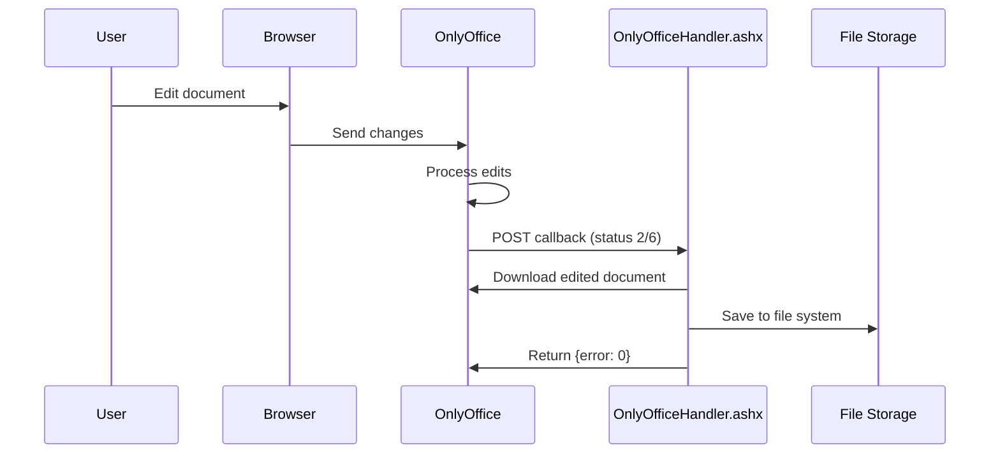

## Overview

When users edit documents in OnlyOffice, the Document Server sends HTTP callbacks to your application to notify you of status changes and provide the edited document. The `OnlyOfficeHandler.ashx` endpoint handles these callbacks and automatically saves document changes.

## The Callback Flow



## Callback URL Configuration

The callback URL is automatically set when you load a document:

```csharp OnlyOfficeEditor.ascx.cs:109-110
CallbackUrl = BuildAbsoluteUrl(
    "~/Controls/OnlyOfficeEditor/OnlyOfficeHandler.ashx?action=callback&fileId=" + HttpUtility.UrlEncode(fileId));
```

<Warning>
  **Important**: The callback URL must be accessible from the OnlyOffice Document Server, not just from the user's browser. If OnlyOffice cannot reach this URL, documents cannot be saved.
</Warning>

### Public Base URL

Use `PublicBaseUrl` to ensure OnlyOffice can reach your application:

```csharp
// If your app is behind a reverse proxy or load balancer
docEditor.PublicBaseUrl = "https://public-domain.com";

// For internal network deployments
docEditor.PublicBaseUrl = "https://192.168.10.34:44311";
```

## Callback Handler Implementation

The callback handler processes POST requests from OnlyOffice:

```csharp OnlyOfficeHandler.ashx.cs:71-109
private static void Callback(HttpContext context)
{
    string body;
    using (var reader = new StreamReader(context.Request.InputStream, Encoding.UTF8))
    {
        body = reader.ReadToEnd();
    }

    var serializer = new JavaScriptSerializer();
    var responseObj = new { error = 0 };

    try
    {
        var payload = serializer.Deserialize<OnlyOfficeCallbackPayload>(body);
        var fileId = context.Request["fileId"];
        var uploads = UploadsPath(context);
        var currentPath = ResolveStoredFile(uploads, fileId);

        // Status 2 = document is being saved
        // Status 6 = document is being edited, force save
        if (payload != null && (payload.status == 2 || payload.status == 6) 
            && !string.IsNullOrWhiteSpace(payload.url) 
            && !string.IsNullOrWhiteSpace(currentPath))
        {
            ServicePointManager.SecurityProtocol = SecurityProtocolType.Tls12 | SecurityProtocolType.Tls11 | SecurityProtocolType.Tls;
            var req = (HttpWebRequest)WebRequest.Create(payload.url);
            req.Method = "GET";
            using (var resp = (HttpWebResponse)req.GetResponse())
            using (var stream = resp.GetResponseStream())
            using (var fs = File.Create(currentPath))
            {
                stream.CopyTo(fs);
            }
        }
    }
    catch
    {
        responseObj = new { error = 1 };
    }

    context.Response.ContentType = "application/json";
    context.Response.Write(serializer.Serialize(responseObj));
}
```

## Callback Payload Structure

OnlyOffice sends a JSON payload with the callback:

```json
{
  "status": 2,
  "url": "https://docserver.com/cache/files/abc123/output.docx",
  "changesurl": "https://docserver.com/cache/files/abc123/changes.zip",
  "history": { ... },
  "users": ["user1"],
  "key": "document_key_12345"
}
```

The handler deserializes this into a simple payload object:

```csharp OnlyOfficeHandler.ashx.cs:151-155
private class OnlyOfficeCallbackPayload
{
    public int status { get; set; }
    public string url { get; set; }
}
```

## Document Status Codes

OnlyOffice sends different status codes to indicate document state:

| Status | Name | Description | Handler Action |
|--------|------|-------------|----------------|
| 0 | Not found | Document not found in cache | None |
| 1 | Editing | Document is being edited | None |
| **2** | **Ready** | **Document ready to save** | **Download and save** |
| 3 | Save error | Error while saving | None |
| 4 | Closed | Document closed without changes | None |
| **6** | **Force save** | **Force save request** | **Download and save** |
| 7 | Corrupted | Document corrupted or error | None |

<Note>
  The handler only processes status **2** (ready to save) and **6** (force save), which indicate the document has been edited and needs to be saved.
</Note>

### Status 2: Document Ready to Save

Sent when:
- User closes the document after making changes
- All users finish editing (in collaborative mode)
- Automatic periodic save triggers

### Status 6: Force Save

Sent when:
- Application explicitly requests document save via API
- Admin forces save in OnlyOffice
- Scheduled backup triggers

## Saving Process

When the handler receives status 2 or 6:

1. **Extract file ID** from query string parameter
2. **Locate original file** in storage using the file ID
3. **Download edited document** from OnlyOffice URL
4. **Replace original file** with new content
5. **Return success response** `{error: 0}`

```csharp OnlyOfficeHandler.ashx.cs:89-100
if (payload != null && (payload.status == 2 || payload.status == 6) 
    && !string.IsNullOrWhiteSpace(payload.url) 
    && !string.IsNullOrWhiteSpace(currentPath))
{
    ServicePointManager.SecurityProtocol = SecurityProtocolType.Tls12 | SecurityProtocolType.Tls11 | SecurityProtocolType.Tls;
    var req = (HttpWebRequest)WebRequest.Create(payload.url);
    req.Method = "GET";
    using (var resp = (HttpWebResponse)req.GetResponse())
    using (var stream = resp.GetResponseStream())
    using (var fs = File.Create(currentPath))
    {
        stream.CopyTo(fs);
    }
}
```

## File Storage

Documents are stored in `~/App_Data/uploads/`:

```csharp OnlyOfficeHandler.ashx.cs:36-41
private static string UploadsPath(HttpContext ctx)
{
    var path = ctx.Server.MapPath("~/App_Data/uploads");
    Directory.CreateDirectory(path);
    return path;
}
```

### File Resolution

Files are stored with GUID names and original extensions:

```csharp OnlyOfficeHandler.ashx.cs:43-49
private static string ResolveStoredFile(string uploadsDir, string fileId)
{
    if (string.IsNullOrWhiteSpace(fileId)) return null;
    var matches = Directory.GetFiles(uploadsDir, fileId + ".*");
    if (matches.Length > 0) return matches[0];
    return null;
}
```

Example:
- File ID: `a1b2c3d4e5f6g7h8`
- Stored as: `~/App_Data/uploads/a1b2c3d4e5f6g7h8.docx`

## Response Format

The handler must return a JSON response:

### Success Response

```json
{
  "error": 0
}
```

Tells OnlyOffice the save was successful.

### Error Response

```json
{
  "error": 1
}
```

Tells OnlyOffice the save failed. OnlyOffice will retry the callback.

```csharp OnlyOfficeHandler.ashx.cs:102-108
catch
{
    responseObj = new { error = 1 };
}

context.Response.ContentType = "application/json";
context.Response.Write(serializer.Serialize(responseObj));
```

## Capturing Edited Documents

Beyond automatic saves, you can manually capture edited documents using the `CaptureTriggerId` feature:

```aspx
<oo:OnlyOfficeEditor 
    runat="server" 
    ID="docEditor"
    CaptureTriggerId="btnSave" />

<asp:Button runat="server" ID="btnSave" Text="Save Document" OnClick="btnSave_Click" />
```

When the button is clicked:
1. JavaScript captures the current document state
2. Downloads the document from OnlyOffice
3. Encodes as Base64 and stores in hidden field
4. Triggers postback

```csharp
protected void btnSave_Click(object sender, EventArgs e)
{
    if (docEditor.HasEditedDocument)
    {
        var documentBytes = docEditor.GetEditedDocumentBytes();
        
        // Save to database, cloud storage, etc.
        SaveToDatabase(documentBytes, docEditor.DocumentName);
        
        // Clear the captured document
        docEditor.ClearEditedDocument();
        
        lblStatus.Text = "Document saved successfully!";
    }
}
```

## Error Handling

### Common Callback Failures

<Accordion title="Callback URL not reachable">
  **Symptom**: Documents don't save, no callbacks received
  
  **Causes**:
  - Firewall blocking OnlyOffice server
  - Incorrect `PublicBaseUrl` configuration
  - SSL certificate issues
  
  **Solution**:
  ```csharp
  // Test if OnlyOffice can reach your server
  // Check OnlyOffice logs at /var/log/onlyoffice/documentserver/docservice/out.log
  
  // Ensure PublicBaseUrl is set correctly
  docEditor.PublicBaseUrl = "https://your-public-domain.com";
  ```
</Accordion>

<Accordion title="File not found errors">
  **Symptom**: Callback receives but file isn't updated
  
  **Causes**:
  - File ID mismatch
  - File deleted from storage
  - Permissions issue on uploads directory
  
  **Solution**:
  ```csharp
  // Verify file exists before loading
  var uploads = Server.MapPath("~/App_Data/uploads");
  var filePath = Path.Combine(uploads, fileId + ".docx");
  
  if (File.Exists(filePath))
  {
      docEditor.SetDocumentFromUpload(fileId, "document.docx");
  }
  ```
</Accordion>

<Accordion title="JWT authentication failures">
  **Symptom**: Callbacks rejected with 401 or 403 errors
  
  **Causes**:
  - JWT secret mismatch
  - OnlyOffice expecting JWT but not receiving it
  
  **Solution**: Ensure JWT secrets match (see [JWT Authentication](/concepts/jwt-authentication))
</Accordion>

### Logging Callbacks

Add logging to troubleshoot callback issues:

```csharp
private static void Callback(HttpContext context)
{
    // Log incoming callback
    var logPath = context.Server.MapPath("~/App_Data/logs/callbacks.log");
    Directory.CreateDirectory(Path.GetDirectoryName(logPath));
    
    string body;
    using (var reader = new StreamReader(context.Request.InputStream, Encoding.UTF8))
    {
        body = reader.ReadToEnd();
    }
    
    File.AppendAllText(logPath, 
        $"[{DateTime.Now:yyyy-MM-dd HH:mm:ss}] {body}\n");
    
    // ... rest of callback processing
}
```

## Testing Callbacks Locally

### Using ngrok

For local development, use ngrok to expose your local server:

```bash
ngrok http https://localhost:44311
```

Then configure the public URL:

```csharp
docEditor.PublicBaseUrl = "https://abc123.ngrok.io";
```

### Using IIS Express

Enable external connections in `.vs/config/applicationhost.config`:

```xml
<binding protocol="https" bindingInformation="*:44311:*" />
```

Open firewall port:

```powershell
netsh advfirewall firewall add rule name="IIS Express" dir=in action=allow protocol=TCP localport=44311
```

## Best Practices

<Note>
  **Callback Handler Guidelines:**
  
  1. **Always return a response** - OnlyOffice waits for `{error: 0}` or `{error: 1}`
  2. **Handle exceptions gracefully** - Return `{error: 1}` on any failure
  3. **Log callback data** - Essential for debugging save issues
  4. **Verify file exists** - Check storage before attempting to save
  5. **Use HTTPS** - OnlyOffice requires secure callbacks in production
  6. **Test reachability** - Ensure OnlyOffice can reach your callback URL
</Note>

## Security Considerations

<Warning>
  **Callback Security:**
  
  - Validate callback requests come from OnlyOffice server (IP whitelist)
  - Verify JWT tokens if callback signatures are enabled
  - Sanitize file IDs to prevent directory traversal
  - Implement rate limiting to prevent abuse
  - Use HTTPS for all callback URLs in production
</Warning>

### IP Whitelisting Example

```csharp
private static void Callback(HttpContext context)
{
    // Only accept callbacks from OnlyOffice server
    var allowedIPs = new[] { "192.168.1.100", "10.0.0.50" };
    var clientIP = context.Request.UserHostAddress;
    
    if (!allowedIPs.Contains(clientIP))
    {
        context.Response.StatusCode = 403;
        context.Response.Write("Forbidden");
        return;
    }
    
    // ... process callback
}
```

## Related Topics

- [Configuration Properties](/concepts/configuration) - Set up callback URLs
- [JWT Authentication](/concepts/jwt-authentication) - Secure callbacks
- [Document Types](/concepts/document-types) - Understand different save behaviors by document type